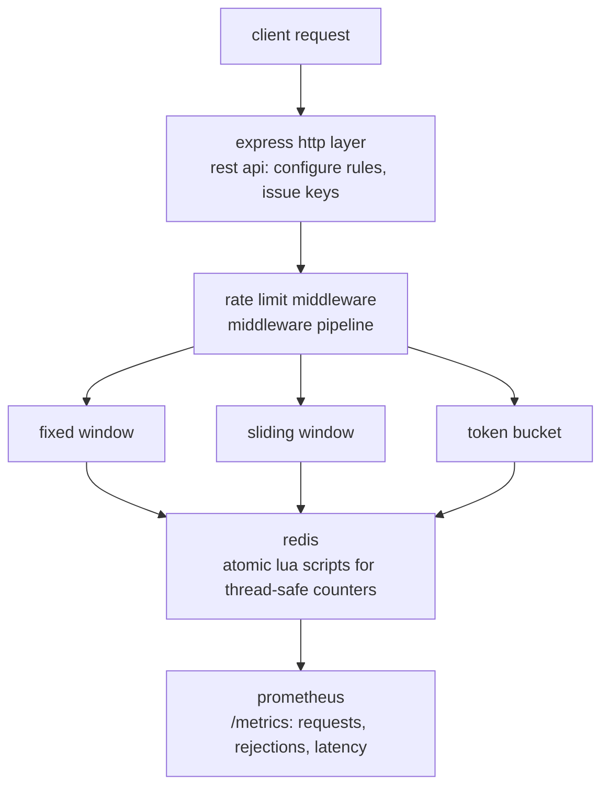

# rate-limiter-as-a-service

a production-grade, redis-backed http rate limiting service built with node.js and typescript. configure per-api-key rate limit rules via a rest api, choose from three battle-tested algorithms, and observe everything through prometheus metrics.

[](https://github.com/bit2swaz/rate-limiter/actions/workflows/ci.yml)

---

## architecture



---

## quick start

### prerequisites

- [docker](https://docs.docker.com/get-docker/) and [docker compose](https://docs.docker.com/compose/install/)
- or node.js 20+ and a local redis 7 instance

### with docker compose (recommended)

```bash
# clone and enter
git clone https://github.com/bit2swaz/rate-limiter.git
cd rate-limiter

# generate a secret
export JWT_SECRET=$(openssl rand -hex 32)

# bring the full stack up (app + redis + prometheus)
docker compose -f docker/docker-compose.yml up --build

# verify the app is healthy
curl http://localhost:3000/health
# {"status":"ok"}
```

### local development (without docker)

```bash
# install dependencies
npm install

# start redis (or use your own)
redis-server --daemonize yes

# copy env and fill in values
cp .env.example .env

# start with hot reload
npm run dev
```

---

## first api call: end-to-end walkthrough

### 1. get an admin jwt

```bash
curl -s -X POST http://localhost:3000/auth/token \
  -H 'content-type: application/json' \
  -d '{"username":"admin","password":"admin"}' | jq .
# {"token":"eyJ..."}
export TOKEN="eyJ..."
```

### 2. issue an api key

```bash
curl -s -X POST http://localhost:3000/keys \
  -H "authorization: Bearer $TOKEN" | jq .
# {"apiKey":"usr_abc123..."}
export API_KEY="usr_abc123..."
```

### 3. create a rate limit rule (sliding window, 5 req / 10 sec)

```bash
curl -s -X POST http://localhost:3000/rules \
  -H "authorization: Bearer $TOKEN" \
  -H 'content-type: application/json' \
  -d "{\"apiKey\":\"$API_KEY\",\"algorithm\":\"sliding_window\",\"limit\":5,\"windowMs\":10000}" | jq .
```

### 4. hit the rate-limited proxy

```bash
# first 5 succeed
for i in $(seq 1 5); do
  curl -s -o /dev/null -w "%{http_code}\n" \
    -H "x-api-key: $API_KEY" http://localhost:3000/proxy/anything
done
# 200 200 200 200 200

# 6th is rejected
curl -s -H "x-api-key: $API_KEY" http://localhost:3000/proxy/anything
# {"error":"rate limit exceeded"}  (HTTP 429)
```

### 5. observe metrics

```bash
curl -s http://localhost:3000/metrics | grep ratelimiter
# ratelimiter_requests_total{api_key="usr_abc123",algorithm="sliding_window"} 6
# ratelimiter_rejections_total{api_key="usr_abc123",algorithm="sliding_window"} 1
# ratelimiter_middleware_duration_seconds_bucket{...} ...
```

---

## api reference

| method | endpoint | auth | description |
|--------|----------|------|-------------|
| POST | `/auth/token` | none | issue a jwt for admin access |
| POST | `/keys` | jwt | create a new api key |
| POST | `/rules` | jwt | create a rate limit rule |
| GET | `/rules/:key` | jwt | get the rule for an api key |
| PUT | `/rules/:key` | jwt | update (patch) a rule |
| DELETE | `/rules/:key` | jwt | delete a rule |
| GET | `/metrics` | none | prometheus metrics (text/plain) |
| GET | `/docs` | none | swagger ui (development only) |
| GET | `/health` | none | health check |
| ANY | `/proxy/*` | api key | rate-limited passthrough endpoint |

### POST /auth/token

```json
// request
{ "username": "admin", "password": "admin" }

// response 200
{ "token": "eyJhbGciOiJIUzI1NiIsInR5cCI6IkpXVCJ9..." }

// response 401
{ "error": "invalid credentials" }
```

### POST /keys

```json
// response 201
{ "apiKey": "usr_V1StGXR8_Z5jdHi6B-myT" }
```

### POST /rules

```json
// sliding_window or fixed_window
{
  "apiKey": "usr_V1StGXR8",
  "algorithm": "sliding_window",
  "limit": 100,
  "windowMs": 60000
}

// token_bucket
{
  "apiKey": "usr_V1StGXR8",
  "algorithm": "token_bucket",
  "capacity": 50,
  "refillRate": 10
}

// response 201: echoes the created rule
// response 400: { "error": "token_bucket requires capacity and refillRate" }
```

### response headers on every `/proxy/*` response

| header | value |
|--------|-------|
| `x-ratelimit-limit` | configured limit or capacity |
| `x-ratelimit-remaining` | requests remaining in current window/bucket |
| `retry-after` | seconds until next allowed request (429 only) |

---

## algorithms

### fixed window counter

splits time into fixed windows of `windowMs` ms. counts requests per window using an atomic `INCR`. simple and fast, but allows burst traffic at window boundaries.

```json
{ "algorithm": "fixed_window", "limit": 100, "windowMs": 60000 }
```

### sliding window log

uses a redis sorted set to track request timestamps within the last `windowMs` ms. old entries are pruned on each request. eliminates boundary bursts at the cost of slightly more memory per key.

```json
{ "algorithm": "sliding_window", "limit": 100, "windowMs": 60000 }
```

### token bucket

tokens refill continuously at `refillRate` per second up to `capacity`. a request consumes one token; if the bucket is empty the request is rejected. ideal for traffic shaping that tolerates small bursts.

```json
{ "algorithm": "token_bucket", "capacity": 50, "refillRate": 10 }
```

---

## configuration

all configuration is via environment variables. copy `.env.example` to `.env` for local development.

| variable | default | description |
|----------|---------|-------------|
| `PORT` | `3000` | http port the server listens on |
| `REDIS_URL` | `redis://localhost:6379` | ioredis connection url |
| `JWT_SECRET` | `dev-secret` | secret used to sign/verify jwts (use a long random value in production) |
| `JWT_EXPIRES_IN` | `7d` | jwt expiry (any value accepted by jsonwebtoken) |
| `ADMIN_USER` | `admin` | username for `POST /auth/token` |
| `ADMIN_PASS` | `admin` | password for `POST /auth/token` |
| `NODE_ENV` | (unset) | set to `production` to disable swagger ui at `/docs` |

generate a production-grade secret:

```bash
openssl rand -hex 32
```

---

## running tests

### prerequisites

redis must be running locally:

```bash
redis-cli ping || redis-server --daemonize yes
```

### run the full suite

```bash
npm test
```

### run with coverage

```bash
npm run test:coverage
```

### run a single file

```bash
npx jest tests/integration/concurrency.test.ts
```

### test categories

| directory | type | description |
|-----------|------|-------------|
| `tests/unit/` | unit | algorithms, redis client, rule service |
| `tests/api/` | api | all express routes via supertest |
| `tests/integration/` | integration | e2e flows, headers, concurrency, edge cases |

---

## project structure

```
rate-limiter/
├── src/
│   ├── algorithms/
│   │   ├── index.ts             # strategy factory, AlgorithmFn type, UnknownAlgorithmError
│   │   ├── fixedWindow.ts       # fixed window counter (INCR + PEXPIRE)
│   │   ├── tokenBucket.ts       # token bucket (delegates to lua)
│   │   └── slidingWindow.ts     # sliding window log (delegates to lua)
│   ├── middleware/
│   │   └── rateLimitMiddleware.ts  # x-api-key header, rule lookup, algorithm dispatch, headers
│   ├── routes/
│   │   ├── keys.ts              # POST /keys
│   │   ├── rules.ts             # CRUD /rules
│   │   └── metrics.ts           # GET /metrics (prometheus)
│   ├── services/
│   │   ├── redisClient.ts       # ioredis singleton + lua script loader
│   │   └── ruleService.ts       # rule CRUD business logic
│   ├── auth/
│   │   └── jwtMiddleware.ts     # signToken, verifyToken, jwtMiddleware, authRouter
│   ├── observability/
│   │   └── metrics.ts           # prom-client counters and histogram
│   ├── app.ts                   # express app (routes mounted, no listen)
│   └── index.ts                 # server entry point (listen)
├── scripts/
│   └── lua/
│       ├── token_bucket.lua     # atomic token replenishment
│       └── sliding_window.lua   # atomic sorted set log
├── docker/
│   ├── Dockerfile               # multi-stage build (builder + runner)
│   ├── docker-compose.yml       # app + redis + prometheus
│   └── prometheus.yml           # prometheus scrape config
├── docs/
│   ├── openapi.yaml             # openapi 3.1 specification
│   ├── adr/                     # architecture decision records
│   ├── ROADMAP.md
│   └── SSOT.md
├── tests/
│   ├── unit/                    # algorithm + service unit tests
│   ├── api/                     # route tests (supertest)
│   └── integration/             # e2e + concurrency + edge case tests
├── .env.example
├── .github/workflows/ci.yml
├── CHANGELOG.md
├── CONTRIBUTING.md
└── README.md
```

---

## generate api docs (typedoc)

```bash
npm run docs
# opens docs/typedoc/index.html
```

---

## docker

### build the image

```bash
docker build -f docker/Dockerfile -t rate-limiter .
```

### full stack

```bash
JWT_SECRET=$(openssl rand -hex 32) docker compose -f docker/docker-compose.yml up --build
```

### tear down

```bash
docker compose -f docker/docker-compose.yml down -v
```

---

## prometheus

prometheus scrapes `/metrics` every 15 seconds. the stack bundles a prometheus instance at `http://localhost:9090`.

useful queries:

```promql
# request rate per algorithm (5m window)
rate(ratelimiter_requests_total[5m])

# rejection rate per api key
rate(ratelimiter_rejections_total[5m])

# p99 middleware latency
histogram_quantile(0.99, rate(ratelimiter_middleware_duration_seconds_bucket[5m]))
```

---

## license

mit
